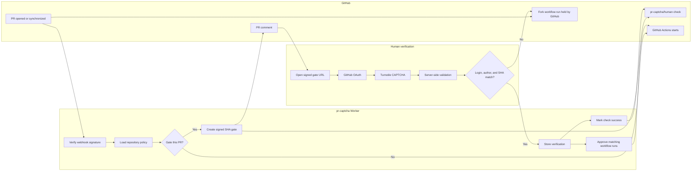

<h1 align="center">pr-captcha</h1>

<p align="center">
  CAPTCHA before CI for GitHub Actions.
</p>

<p align="center">
  
  
  
  
</p>

<p align="center">
  <strong>No CAPTCHA, no CI.</strong>
</p>

`pr-captcha` is a GitHub App that holds suspicious, first-time, and fork pull request workflows until a GitHub-authenticated human solves a browser CAPTCHA for the exact PR head SHA.

It is built for maintainers who do not want low-quality drive-by PRs spending CI minutes before anyone has looked at the work.

<table>
  <tr>
    <td width="33%">
      <strong>Stop waste early</strong><br>
      Native fork approval keeps GitHub Actions paused before runners start.
    </td>
    <td width="33%">
      <strong>Bind proof to code</strong><br>
      Verification is scoped to repository, PR number, author, and head SHA.
    </td>
    <td width="33%">
      <strong>Support every repo</strong><br>
      Use fork approval, a tiny gate Action, a required check, or a hybrid setup.
    </td>
  </tr>
</table>

## Product Snapshot

<table>
  <tr>
    <td><strong>Protects</strong></td>
    <td>GitHub Actions minutes, maintainer attention, and required checks.</td>
  </tr>
  <tr>
    <td><strong>Gates with</strong></td>
    <td>GitHub OAuth, browser CAPTCHA, server-side token validation, PR author policy, and exact SHA binding.</td>
  </tr>
  <tr>
    <td><strong>Never does</strong></td>
    <td>Checks out PR code, runs tests, exposes repo secrets, or trusts PR text.</td>
  </tr>
</table>

<table>
  <tr>
    <td width="33%">
      <strong>Native fork gate</strong><br>
      Zero runner minutes until GitHub releases the held workflow run.
    </td>
    <td width="33%">
      <strong>Universal Action gate</strong><br>
      One tiny job blocks expensive jobs for same-repo and private PRs.
    </td>
    <td width="33%">
      <strong>Required check</strong><br>
      Branch protection can require <code>pr-captcha/human</code> before merge.
    </td>
  </tr>
</table>

## Current Status

This repository is an MVP codebase. The product path is implemented, but it is not deployed as a live production service yet.

<table>
  <tr>
    <td><strong>Built</strong></td>
    <td><strong>Needs live setup</strong></td>
  </tr>
  <tr>
    <td>
      Cloudflare Worker backend<br>
      GitHub App webhooks<br>
      GitHub OAuth<br>
      Cloudflare Turnstile verification<br>
      D1 gate and verification schema<br>
      SHA-bound signed links<br>
      PR comments and check runs<br>
      Workflow approval logic<br>
      Optional universal gate Action<br>
      Landing page and docs
    </td>
    <td>
      Production GitHub App<br>
      OAuth callback URL<br>
      Turnstile site and secret keys<br>
      Production D1 database<br>
      Worker deploy<br>
      Demo repo installation<br>
      Real fork PR approval test
    </td>
  </tr>
</table>

## Architecture



The privileged app treats pull request content as metadata. It approves or denies workflow runs, but never checks out or executes the patch.

## Pull Request Flow

| Step | Event                                                                                 | pr-captcha action                                                 |
| ---- | ------------------------------------------------------------------------------------- | ----------------------------------------------------------------- |
| 1    | PR opens from fork, first-time contributor, outside contributor, or configured target | Creates a gate for repository, PR number, PR author, and head SHA |
| 2    | GitHub creates a workflow run that is awaiting approval                               | Posts a verification comment and creates `pr-captcha/human`       |
| 3    | Contributor opens the gate link                                                       | Requires GitHub OAuth login                                       |
| 4    | Contributor solves CAPTCHA                                                            | Validates Turnstile token server-side                             |
| 5    | Verification passes                                                                   | Approves held workflow runs for that exact SHA                    |
| 6    | Contributor pushes another commit                                                     | Old verification no longer applies                                |

## Integration Modes

<table>
  <tr>
    <td><strong>Use this</strong></td>
    <td><strong>When</strong></td>
    <td><strong>What it saves</strong></td>
  </tr>
  <tr>
    <td>Native fork gate</td>
    <td>Public repositories receiving fork PRs from outside contributors.</td>
    <td>All runner minutes before verification.</td>
  </tr>
  <tr>
    <td>Universal Action gate</td>
    <td>Same-repo PRs, private repositories, or workflows that need a portable gate.</td>
    <td>Expensive jobs after the tiny gate job.</td>
  </tr>
  <tr>
    <td>Required check</td>
    <td>Repositories that want merge protection even when CI already ran.</td>
    <td>Maintainer review time and merge risk.</td>
  </tr>
  <tr>
    <td>Hybrid</td>
    <td>Most serious repositories.</td>
    <td>CI minutes, merge safety, and clear contributor UX.</td>
  </tr>
</table>

### Native Fork Gate

Best for public open-source repositories.

GitHub already has an awaiting-approval state for fork PR workflows. `pr-captcha` becomes the approval layer and releases the held workflow only after human verification.

```txt
Settings -> Actions -> General
Fork pull request workflows
Require approval for outside contributors
```

### Universal Action Gate

Best for same-repo PRs, private repositories, and repositories that want a workflow-level gate.

```yaml
name: CI

on:
  pull_request:

jobs:
  human-gate:
    name: pr-captcha / human gate
    runs-on: ubuntu-latest
    steps:
      - uses: aryabyte21/pr-captcha/packages/action@v1
        with:
          api-url: https://pr-captcha.example.com

  test:
    needs: human-gate
    runs-on: ubuntu-latest
    steps:
      - uses: actions/checkout@v4
      - run: npm ci
      - run: npm test
```

### Required Check

Best for branch protection.

`pr-captcha` creates a `pr-captcha/human` check run on the PR SHA. Repositories can require that check before merge.

## Mode Comparison

| Capability                         | Native fork gate      | Universal Action gate   | Required check          |
| ---------------------------------- | --------------------- | ----------------------- | ----------------------- |
| Stops CI before runner starts      | Yes                   | Partially               | No                      |
| Works for fork PRs                 | Yes                   | Yes                     | Yes                     |
| Works for same-repo PRs            | No                    | Yes                     | Yes                     |
| Runner minutes before verification | Zero                  | Tiny gate job           | Zero by itself          |
| Blocks merge                       | With required check   | With required check     | Yes                     |
| Best use case                      | Public repo fork spam | Broad workflow adoption | Merge protection signal |

## Repository Config

```yaml
# .github/pr-captcha.yml

mode: hybrid

captcha:
  provider: cloudflare_turnstile

require:
  github_login: true
  solver_must_be_pr_author: true
  new_sha_requires_new_captcha: true

apply_to:
  first_time_contributors: true
  outside_contributors: true
  fork_prs: true
  bots: true

skip:
  authors:
    - dependabot[bot]
    - renovate[bot]
  labels:
    - trusted-contributor
    - no-captcha

checks:
  create_required_check: true
  name: pr-captcha/human

comment:
  enabled: true
  tone: direct

universal_gate:
  rerun_after_verification: true
```

## GitHub App Permissions

| Permission    | Access | Why                                                                    |
| ------------- | ------ | ---------------------------------------------------------------------- |
| Metadata      | Read   | Required by GitHub Apps.                                               |
| Pull requests | Read   | Read PR author, labels, fork state, and head SHA.                      |
| Issues        | Write  | Create or update the PR comment with the verification link.            |
| Checks        | Write  | Create `pr-captcha/human` check runs.                                  |
| Actions       | Write  | Approve held fork PR workflow runs and rerun universal-gate workflows. |
| Contents      | Read   | Optional `.github/pr-captcha.yml` config loading.                      |

## Local Development

<table>
  <tr>
    <td><strong>Install</strong></td>
    <td><code>npm install</code></td>
  </tr>
  <tr>
    <td><strong>Check</strong></td>
    <td><code>npm run check</code></td>
  </tr>
  <tr>
    <td><strong>Test</strong></td>
    <td><code>npm run test</code></td>
  </tr>
  <tr>
    <td><strong>Build</strong></td>
    <td><code>npm run build</code></td>
  </tr>
  <tr>
    <td><strong>Serve locally</strong></td>
    <td><code>cd apps/worker && npm run dev -- --port 8787</code></td>
  </tr>
</table>

Apply the local D1 migration:

```sh
cd apps/worker
npm run db:migrate:local
```

Open the landing page:

```txt
http://localhost:8787
```

## Project Layout

```txt
apps/worker
  Cloudflare Worker, GitHub App backend, OAuth, Turnstile, landing page

packages/action
  Optional GitHub Action for universal gate mode

examples
  Example config and workflow snippets

docs
  Architecture, config, operations, GitHub App setup, production goal
```

## Security Model

Verification is bound to:

- repository owner and name
- pull request number
- PR author
- exact head SHA
- GitHub OAuth session
- server-side Turnstile validation

The Worker never runs:

```txt
npm install
pytest
go test
make
```

## Production Path

See [docs/production-goal.md](docs/production-goal.md).

High-priority work before public launch:

- deploy production Worker
- create production GitHub App and OAuth app
- add webhook delivery deduplication
- add rate limits by IP, GitHub login, repository, and PR number
- add audit log rows for every gate event
- add replay protection and nonce tracking
- add end-to-end tests with real fork PR fixtures
- add operator retry path for failed GitHub approvals
- publish setup guide and demo video

## Launch Line

```txt
I built CAPTCHA before CI.

Open a PR from a fork.
CI stays paused.
Solve CAPTCHA.
GitHub Actions starts.
```
