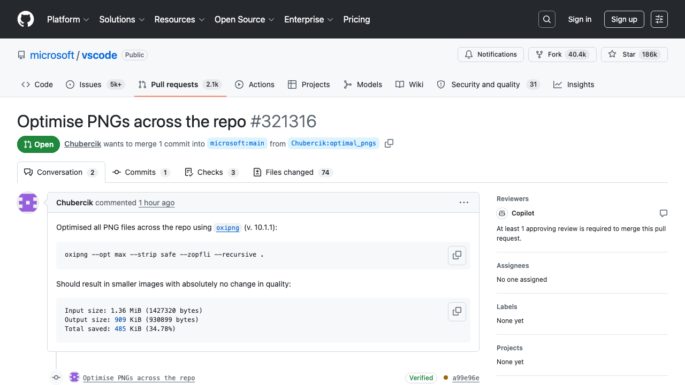
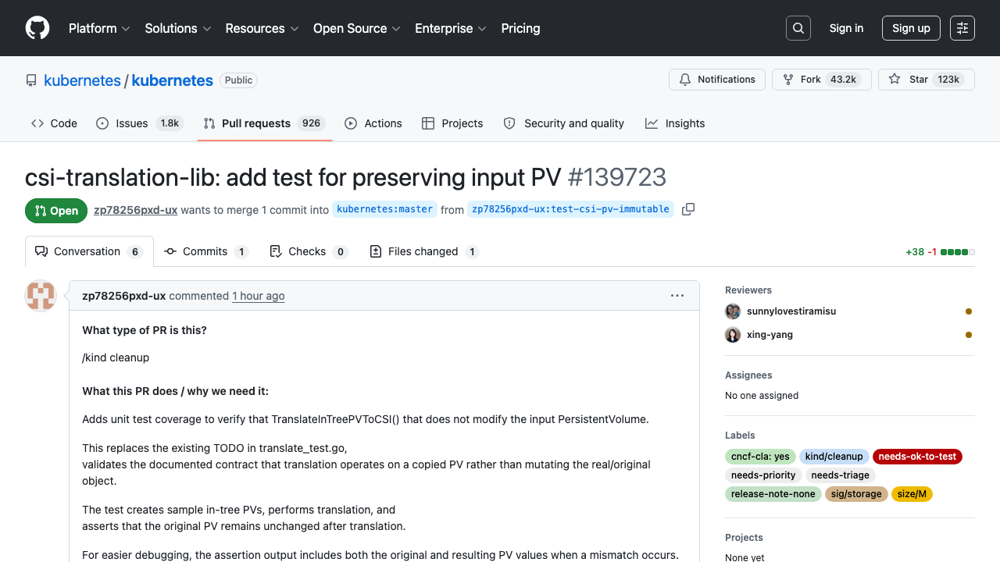
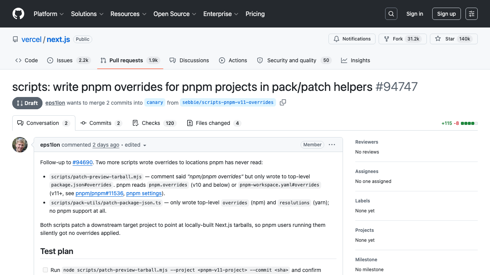
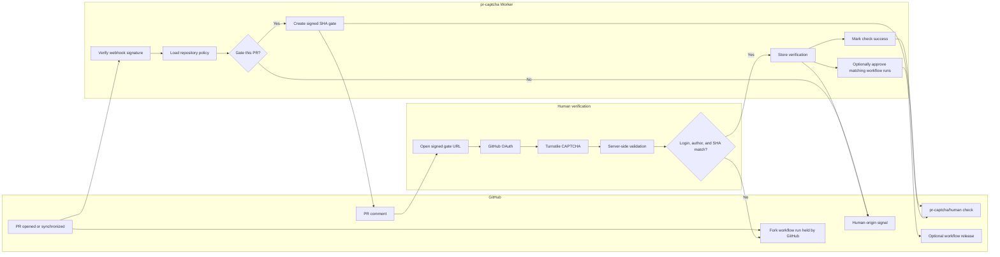

<h1 align="center">pr-captcha</h1>

<p align="center">
  Make AI slop and PR spam knock before CI.
</p>

<p align="center">
  
  
  
  
</p>

<p align="center">
  <strong>Make AI slop prove a human is present.</strong>
</p>

`pr-captcha` is a free hosted GitHub App for public repositories that want AI slop and PR spam to knock before the repo spends maintainer attention.

It gates pull requests until a GitHub-authenticated human verifies the exact head SHA. By default that includes owner branches, member branches, forks, first-time contributors, outside authors, and bot PR workflows. The Worker never checks out the patch. It reads metadata, asks for a browser CAPTCHA, and publishes a SHA-bound human-origin signal. For fork workflows that GitHub already holds, it can also release CI after verification.

## Why this exists

Open source PRs are real work queues. Mature projects already have reviews, labels, branch protection, and workflow approvals. The weak point is earlier: AI slop, bot accounts, and drive-by PRs can enter the queue, create status noise, request labels, and cause the tiny sigh before a maintainer decides whether to even open the diff. Greptile's OpenClaw writeup is the punchline in chart form: when PRs get cheap enough to send, maintainers inherit the inbox problem.

Hosted launch page:

```txt
https://aryabyte21.github.io/pr-captcha/
```

These are public PR pages from busy repositories, captured on June 14, 2026:

| VS Code                                                           | Kubernetes                                                               | Next.js                                                           |
| ----------------------------------------------------------------- | ------------------------------------------------------------------------ | ----------------------------------------------------------------- |
|  |  |  |

`pr-captcha` does one narrow thing: it makes PR authors prove a real GitHub user is present before the PR becomes maintainer work. It is not AI detection. It is a CAPTCHA at intake.

The landing page can hydrate live open-PR counts from GitHub and falls back to the captured snapshot if the public API is unavailable or slow.

Try the shareable dry run before installing:

```txt
https://<worker-domain>/demo
```

Measure your weekly PR queue pressure before choosing a policy:

```txt
https://<worker-domain>/queue-pressure
```

Scan a real repository for fork pressure, unknown authors, stale PRs, and spam labels:

```txt
https://<worker-domain>/evidence
```

Watch public open-source PR spam and invalid-label evidence before choosing a policy:

```txt
https://<worker-domain>/radar
```

Review security, privacy, terms, support, abuse, incident, and beta policy docs before sending real traffic:

```txt
https://<worker-domain>/trust
```

Generate a README badge after install:

```txt
https://<worker-domain>/badge-builder
```

Generate a shareable PR proof card after verification:

```txt
https://<worker-domain>/proof-card
```

Generate a shareable repository queue scorecard after scanning evidence:

```txt
https://<worker-domain>/scorecard-builder
```

Rehearse a disposable fork PR before enabling branch protection:

```txt
https://<worker-domain>/rehearsal
```

Trace the gate from signed webhook to required check:

```txt
https://<worker-domain>/gate-trace
```

## Product Snapshot

<table>
  <tr>
    <td><strong>Stops</strong></td>
    <td>Unverified PRs from blending into the maintainer queue.</td>
  </tr>
  <tr>
    <td><strong>Protects</strong></td>
    <td>Maintainer attention, required checks, and heavy automation where configured.</td>
  </tr>
  <tr>
    <td><strong>Gates with</strong></td>
    <td>GitHub OAuth, browser CAPTCHA, server-side token validation, PR author policy, and exact SHA binding.</td>
  </tr>
  <tr>
    <td><strong>Never does</strong></td>
    <td>Checks out PR code, runs tests, exposes repo secrets, or trusts PR text.</td>
  </tr>
</table>

## What it does

<table>
  <tr>
    <td width="33%">
      <strong>PR intake check</strong><br>
      A required SHA-bound human-origin check appears as soon as the PR opens.
    </td>
    <td width="33%">
      <strong>Native fork release</strong><br>
      GitHub's held fork workflow can be released after verification.
    </td>
    <td width="33%">
      <strong>Workflow gate</strong><br>
      One tiny job can block heavy jobs for same-repo and private PRs.
    </td>
  </tr>
</table>

## Test the gate path locally

Run the focused gate proof before changing webhook, CAPTCHA, check run, or Action behavior:

```sh
npm test --workspace apps/worker -- src/gate-flow.test.ts
```

The contract test simulates a signed GitHub pull request webhook, creates the pending `pr-captcha/human` check, runs the shipped Action against the Worker status API, solves the Turnstile gate for the exact head SHA, updates the GitHub check to success, approves a held fork workflow, reruns a failed workflow, and then proves the Action passes for the same commit.

## Current Status

This repository is an MVP codebase with a live GitHub Pages launch page and a free hosted Worker path for beta installs. The public front door is deployed at `https://aryabyte21.github.io/pr-captcha/`.

<table>
  <tr>
    <td><strong>Built</strong></td>
    <td><strong>Needs live setup</strong></td>
  </tr>
  <tr>
    <td>
      Cloudflare Worker backend<br>
      GitHub App webhooks<br>
      GitHub OAuth<br>
      Cloudflare Turnstile verification<br>
      D1 gate and verification schema<br>
      SHA-bound signed links<br>
      Hashed gate token storage<br>
      Single-use gate nonce<br>
      Signed CSRF form token<br>
      PR comments and check runs<br>
      Webhook delivery deduplication<br>
      Gate and webhook rate limits<br>
      Audit log table and gate events<br>
      Admin audit log export<br>
      Admin repository diagnostics<br>
      Repository diagnostics console<br>
      Public interactive demo<br>
      Public queue pressure calculator<br>
      Public open-source PR spam radar with repository pressure board<br>
      Public Trust Center and launch docs<br>
      Public README badge builder<br>
      Public PR proof-card generator<br>
      Public repository scorecard generator<br>
      Public GitHub App manifest builder<br>
      Public fork PR rehearsal console<br>
      Public gate trace smoke-test console<br>
      Public status page<br>
      Public setup wizard<br>
      Public config preview page<br>
      Beta installation allowlist<br>
      CI, Pages, and Worker deploy workflows<br>
      Structured redacted error logs<br>
      Scheduled expired-row cleanup<br>
      Admin retry endpoint for verified gates<br>
      Workflow approval logic<br>
      Optional universal gate Action<br>
      Landing page and docs
    </td>
    <td>
      Production GitHub App<br>
      OAuth callback URL<br>
      Turnstile site and secret keys<br>
      Production D1 database<br>
      Worker deploy<br>
      Demo repo installation<br>
      Real fork PR approval test
    </td>
  </tr>
</table>

## Architecture



The privileged app treats pull request content as metadata. It publishes a human-origin signal and can approve held fork workflow runs, but never checks out or executes the patch.

## Pull Request Flow

| Step | Event                                                                                  | pr-captcha action                                                 |
| ---- | -------------------------------------------------------------------------------------- | ----------------------------------------------------------------- |
| 1    | PR opens under an enabled target: every PR by default, or a narrower configured target | Creates a gate for repository, PR number, PR author, and head SHA |
| 2    | The pull request webhook arrives                                                       | Posts a verification comment and creates `pr-captcha/human`       |
| 3    | Contributor opens the gate link                                                        | Requires GitHub OAuth login                                       |
| 4    | Contributor solves CAPTCHA                                                             | Validates Turnstile token server-side                             |
| 5    | Verification passes                                                                    | Marks the exact SHA as human-verified and optionally releases CI  |
| 6    | Contributor pushes another commit                                                      | Old verification no longer applies                                |

## Integration Modes

<table>
  <tr>
    <td><strong>Use this</strong></td>
    <td><strong>When</strong></td>
    <td><strong>What it saves</strong></td>
  </tr>
  <tr>
    <td>PR intake check</td>
    <td>Busy public repositories receiving unknown or automated pull requests.</td>
    <td>Maintainer attention before triage and review.</td>
  </tr>
  <tr>
    <td>Native fork release</td>
    <td>Public repositories where GitHub already holds fork workflow runs.</td>
    <td>Held fork jobs before verification.</td>
  </tr>
  <tr>
    <td>Workflow gate</td>
    <td>Same-repo PRs, private repositories, or workflows that need a portable gate.</td>
    <td>Heavy jobs after the tiny gate job.</td>
  </tr>
  <tr>
    <td>Hybrid</td>
    <td>Most serious repositories.</td>
    <td>Queue hygiene, merge safety, and clear contributor UX.</td>
  </tr>
</table>

### PR Intake Check

Best for busy public repositories.

`pr-captcha` creates a `pr-captcha/human` check run on the PR SHA as soon as the pull request opens or updates. Repositories can require that check before merge, use it in triage automation, or show it as a visible signal for maintainers.

### Native Fork Release

Best when GitHub already holds fork workflows.

GitHub already has an awaiting-approval state for fork PR workflows. `pr-captcha` becomes the approval layer and releases the held workflow only after human verification.

```txt
Settings -> Actions -> General
Fork pull request workflows
Require approval for outside contributors
```

### Workflow Gate

Best for same-repo PRs, private repositories, and repositories that want a workflow-level gate.
The Action validates the status response schema and fails closed if the Worker returns a malformed status response.

```yaml
name: CI

on:
  pull_request:

jobs:
  human-gate:
    name: pr-captcha / human gate
    runs-on: ubuntu-latest
    steps:
      - uses: aryabyte21/pr-captcha/packages/action@v1
        with:
          api-url: https://pr-captcha.example.com

  test:
    needs: human-gate
    runs-on: ubuntu-latest
    steps:
      - uses: actions/checkout@v4
      - run: npm ci
      - run: npm test
```

## Mode Comparison

| Capability                         | PR intake check      | Native fork release        | Workflow gate           |
| ---------------------------------- | -------------------- | -------------------------- | ----------------------- |
| Creates PR-visible human signal    | Yes                  | Yes                        | Yes                     |
| Stops CI before runner starts      | No                   | Yes                        | Partially               |
| Works for fork PRs                 | Yes                  | Yes                        | Yes                     |
| Works for same-repo PRs            | Yes                  | No                         | Yes                     |
| Runner minutes before verification | Zero by itself       | Zero                       | Tiny gate job           |
| Blocks merge                       | With required check  | With required check        | With required check     |
| Best use case                      | Public triage queues | GitHub-held fork workflows | Broad workflow adoption |

## Repository Config

```yaml
# .github/pr-captcha.yml

mode: hybrid

captcha:
  provider: cloudflare_turnstile

require:
  github_login: true
  solver_must_be_pr_author: true
  new_sha_requires_new_captcha: true

apply_to:
  all_pull_requests: true
  first_time_contributors: true
  outside_contributors: true
  fork_prs: true
  bots: true

skip:
  authors: []
  labels:
    - trusted-contributor
    - no-captcha

checks:
  create_required_check: true
  name: pr-captcha/human

comment:
  enabled: true
  tone: direct

universal_gate:
  rerun_after_verification: true
```

`github_login` and `new_sha_requires_new_captcha` are enforced security invariants. False values are ignored so every passed gate is still bound to a GitHub-authenticated user and the exact PR head SHA. Set `solver_must_be_pr_author: false` only if repository maintainers with write, maintain, or admin access may verify on behalf of contributors. Bot-authored pull requests can also be verified by maintainers because bot accounts cannot complete GitHub OAuth.

`all_pull_requests` gates owner branches, member branches, forks, outside contributors, first-time contributors, and bots. Turn it off only when a repository intentionally wants a narrower policy.

`outside_contributors` covers any GitHub PR author association that is not `OWNER`, `MEMBER`, or `COLLABORATOR`, including repeat external contributors.

`skip.authors` and `skip.labels` are matched case-insensitively.

`required_check` always creates its check run. In `native_fork` and `hybrid`, pr-captcha keeps the PR comment enabled if checks are disabled so the verification link is still visible.

## GitHub App Permissions

| Permission    | Access | Why                                                                    |
| ------------- | ------ | ---------------------------------------------------------------------- |
| Metadata      | Read   | Required by GitHub Apps.                                               |
| Pull requests | Write  | Read PR metadata and update PR review surfaces.                        |
| Issues        | Write  | Create or update the PR comment with the verification link.            |
| Checks        | Write  | Create `pr-captcha/human` check runs.                                  |
| Actions       | Write  | Approve held fork PR workflow runs and rerun universal-gate workflows. |
| Contents      | Read   | Optional `.github/pr-captcha.yml` config loading.                      |

## Local Development

<table>
  <tr>
    <td><strong>Install</strong></td>
    <td><code>npm install</code></td>
  </tr>
  <tr>
    <td><strong>Check</strong></td>
    <td><code>npm run check</code></td>
  </tr>
  <tr>
    <td><strong>Test</strong></td>
    <td><code>npm run test</code></td>
  </tr>
  <tr>
    <td><strong>Critical path</strong></td>
    <td><code>npm test --workspace @pr-captcha/worker -- gate-flow.test.ts</code></td>
  </tr>
  <tr>
    <td><strong>Build</strong></td>
    <td><code>npm run build</code></td>
  </tr>
  <tr>
    <td><strong>Serve locally</strong></td>
    <td><code>cd apps/worker && npm run dev -- --port 8787</code></td>
  </tr>
</table>

Apply the local D1 migration:

```sh
cd apps/worker
npm run db:migrate:local
```

Open the landing page:

```txt
http://localhost:8787
```

## Project Layout

```txt
apps/worker
  Cloudflare Worker, GitHub App backend, OAuth, Turnstile, landing page

packages/action
  Optional GitHub Action for universal gate mode

examples
  Example config and workflow snippets

docs
  Setup guide, architecture, config, operations, GitHub App setup, production goal
```

## Security Model

Verification is bound to:

- repository owner and name
- pull request number
- PR author
- exact head SHA
- GitHub OAuth session
- server-side Turnstile validation

The Worker never runs:

```txt
npm install
pytest
go test
make
```

## Production Path

See [docs/production-goal.md](docs/production-goal.md).

Start with [docs/setup.md](docs/setup.md) for the maintainer install path, open `/trust` for public security and policy docs, open `/launch` on a deployed Worker for the production cockpit, use `/rehearsal` for the disposable fork PR dry run, use `/gate-trace` for the webhook-to-check smoke test, or open `/github-app-manifest` to generate the GitHub App registration payload.

Before enabling production deploys, run `npm run check:deploy-env` with `CLOUDFLARE_ACCOUNT_ID` and `CLOUDFLARE_API_TOKEN` set. The same preflight runs in `.github/workflows/worker-deploy.yml` before Wrangler deploys.

High-priority work before public launch:

- deploy production Worker
- create production GitHub App and OAuth app
- tune rate-limit thresholds from beta traffic
- add real GitHub delivery replay fixtures
- record demo video or GIF from a clean fork PR

## Launch Line

```txt
I built a CAPTCHA for AI-slop PRs.

Open an unknown PR.
pr-captcha makes it knock.
GitHub login. CAPTCHA. Exact commit.
The check is bound to one GitHub user and one commit SHA.
Review still decides. Slop waits outside.
```
